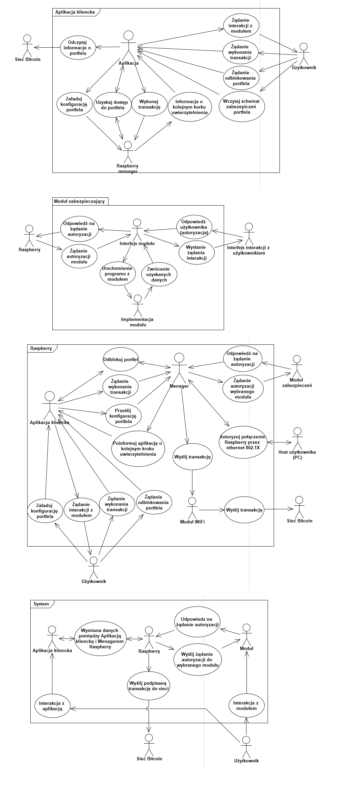

# UMLDiagrams
UML in EAP 9 diagrams

## Sequence diagrams

#### Reading wallet state from JSON file

```sequence
Użytkownik->Raspberry Wallet:Żądanie odblokowania portfela
Raspberry Wallet->Użytkownik:Prośba o podanie hasła
Użytkownik->Raspberry Wallet:Wprowadzenie hasła
Raspberry Wallet->Plik JSON:Odczytanie zawartości
Plik JSON-->Raspberry Wallet:
Raspberry Wallet->Raspberry Wallet:Odszyfrowanie zawartości
Raspberry Wallet-->Użytkownik:Komunikat o powodzeniu
alt błędne hasło
Raspberry Wallet->Raspberry Wallet:Błąd podczas odszyfrowywania
Raspberry Wallet-->Użytkownik:Komunikat o błędzie
end
```

#### Wallet initialization

```sequence
Użytkownik->Raspberry Wallet:Podanie ziarna portfela
Użytkownik->Raspberry Wallet:Podanie danych wejściowych\ndla M modułów
Raspberry Wallet->Shamir:Wygenerowanie M kluczy\nz czego N jest wymaganych
loop dla kazdego wybranego modułu
Raspberry Wallet->Moduły:Ustaw wymagane dane wejściowe modułu
Raspberry Wallet->Moduły:Zaszyfruj część klucza
Raspberry Wallet->Baza Danych:Zapisz zaszyfrowaną część klucza dla danego modułu 
end 
Raspberry Wallet->BitcoinJ:Stwórz portfel na podstawie ziarna
BitcoinJ->BitcoinJ:Synchronizacja wewnętrzna
loop dla każdego wybranego modułu 
Raspberry Wallet->Baza Danych:Pobierz zaszyfrowaną częśc klucza 
Baza Danych-->Raspberry Wallet:Zwróć zaszyfrowaną część klucza
Raspberry Wallet->Moduły:Odszyfruj część klucza
Moduły-->Raspberry Wallet:Zwróć odszyfrowaną część klucza
end
Raspberry Wallet->Shamir: Rekonstrukcja klucza \nna podstawie części
Shamir-->Raspberry Wallet: Klucz prywatny

Raspberry Wallet->BitcoinJ:Stwórz hash na podstawie klucza prywatnego i przekaż go
BitcoinJ->BitcoinJ: Zaszyfruj portfel \n haszem klucza prywatnego
BitcoinJ->BitcoinJ: Zapisz portfel do pliku 
BitcoinJ->BitcoinJ: Odszyfruj portfel \nhaszem klucza prywatnego
```

#### Wallet unlocking

```sequence
Użytkownik->Raspberry Wallet:Żądanie odszyfrowania portfela
Raspberry Wallet->Użytkownik: Żądanie podania wymaganych danych do oblokowania modułów
Użytkownik->Raspberry Wallet: Wprowadzenie danych
Raspberry Wallet->Moduły: Wprowadzenie danych

loop odszyfrowywanie pojedycznych sekretów
Raspberry Wallet->Raspberry Wallet: Wczytanie [1 z n] zaszyfrowanych sekretów
Raspberry Wallet->Moduły: Żądanie odszyfrowania sekretu
Moduły-->Raspberry Wallet: Zwrócenie odszyfrowanego sekretu
  alt błąd
  Moduły->Raspberry Wallet: Błąd odszyfrowywania
  end
end

Raspberry Wallet->Użytkownik: Zwrócenie rezultatu odszyfrowywania portfela
```

#### Authorization server wallet initialization

```sequence
Raspberry Wallet->Raspberry Wallet:Wygenerowanie lub odczytanie UUID portfela
Raspberry Wallet->Serwer autoryzacji:Rejestracja portfela(UUID, hasło)
Serwer autoryzacji->Serwer autoryzacji:Sprawdzenie czy nie był zarejestrowany
alt błąd - portfel już zarejestrowany
Serwer autoryzacji-->Raspberry Wallet:Błąd rejestracji
end 
Serwer autoryzacji->Serwer autoryzacji:Wygenerowanie hasha hasła
Serwer autoryzacji->Redis:Zapisanie danych logowania portfela
Serwer autoryzacji-->Raspberry Wallet:Sukces
Raspberry Wallet->Serwer autoryzacji:Logowanie(UUID, hasło)
Serwer autoryzacji->Redis:Weryfikacja danych
Serwer autoryzacji->Redis:Zapisanie tokenu sesji
Serwer autoryzacji-->Raspberry Wallet: Zwrócenie tokenu sesji

Raspberry Wallet->Serwer autoryzacji:Zapisanie sekretu modułu(token, sekret)
Serwer autoryzacji->Redis:Weryfikacja tokenu sesji
Serwer autoryzacji->Redis:Zapisanie sekretu portfelaUżytkownik->Raspberry Wallet:Żądanie odblokowania portfela
Raspberry Wallet->Użytkownik:Prośba o podanie hasła
Użytkownik->Raspberry Wallet:Wprowadzenie hasła
Raspberry Wallet->Plik JSON:Odczytanie zawartości
Plik JSON-->Raspberry Wallet:
Raspberry Wallet->Raspberry Wallet:Odszyfrowanie zawartości
Raspberry Wallet-->Użytkownik:Komunikat o powodzeniu
alt błędne hasło
Raspberry Wallet->Raspberry Wallet:Błąd podczas odszyfrowywania
Raspberry Wallet-->Użytkownik:Komunikat o błędzie
end
Serwer autoryzacji-->Raspberry Wallet:Sukces
```

#### Iterational implementation process

```sequence
loop Zbieranie zadań do wykonania w kolejnej iteracji
Programista->Issue:Stworzenie nowego Issue\nz propozycją nowej funkcjonalności
Zespół->Issue:Dyskusja na temat Issue
Zespół->Issue:Zatwierdzenie Issue
Programista->Issue:Przypisanie się do implementacji Issue
end
Programista->Branch:Implementacja funkcjonalności opisanych w Issues przypisanych do iteracji
Zespół->Branch:Uwagi na temat\nimplementacji
Programista->Branch:Zakończenie implementacji funkcjonalności dla danej iteracji
Programista->Pull Request:Stworzenie nowego pull requesta podsumowującego iterację
Pull Request->CircleCI:Próba zbudowania\nnowej wersji
CircleCI->Pull Request:Zatwierdzenie zmian
Pull Request->Zespół:Prośba o weryfikację
Zespół->Pull Request:Weryfikacja zmian
Programista->Branch:Implementacja zmian zasugerowanych przez zespół
Zespół->Pull Request:Zatwierdzenie zmian
Programista->Branch:Zmergownie brancha
Pull Request->Issue:Zamknięcie wykonanych Issues
Pull Request->Branch:Usunięcie brancha
Pull Request->Pull Request:Zamknięcie Pull Requesta
```



#### P2SH
```
Alice->Bob:Podaj mi adres do przelewu
Bob->Bob:Generuj skomplikowany skrypt do przelewu
Bob->Bob:Adres P2SH = skrót(skomplikowany skrypt)
Bob-->Alice: Adres do przelewu
Alice->Alice:Stwórz i podpisz prostą transakcje \nna otrzymany adres
Alice->Bitcoin:Opublikuj transakcje
Bob->Charlie:Podaj mi adres do przelewu
Charlie->Charlie:Generuj prosty skrypt do przelewu
Charlie->Charlie:Adres P2PKH = skrót(klucz publiczny) 
Charlie-->Bob:Adres do przelewu
Bob->Bob:Stworz i podpisz skomplikowaną transakcje \nna otrzymany adres
Bob->Bitcoin:Opublikuj transakcje
```


